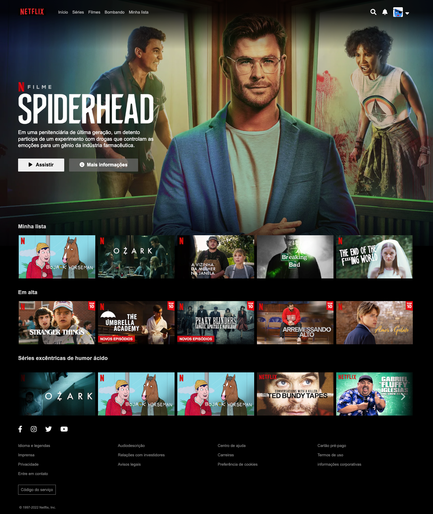

<h1 align="center">Clone da página inicial da Netflix</h1>

 
 Status do projeto: :heavy_check_mark: (Concluido)

## 💻 Sobre o projeto

Desafio proposto para prática de HTML e CSS no 7DaysOfCode da Alura.

## Deploy:

https://cecilia-rds.github.io/Pagina-inicial-netflix

## 🛠 Tecnologias

  

## Developers

| https://github.com/cecilia-rds |
